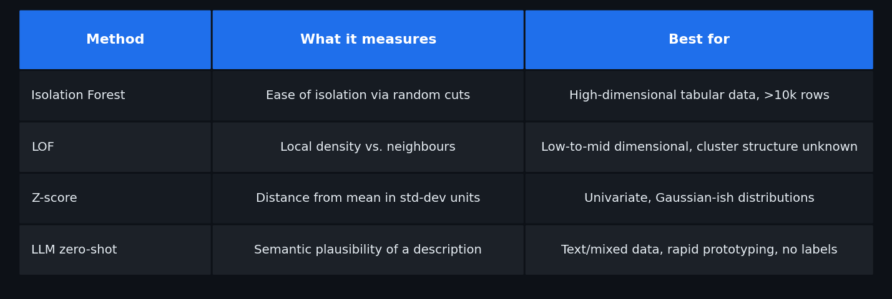
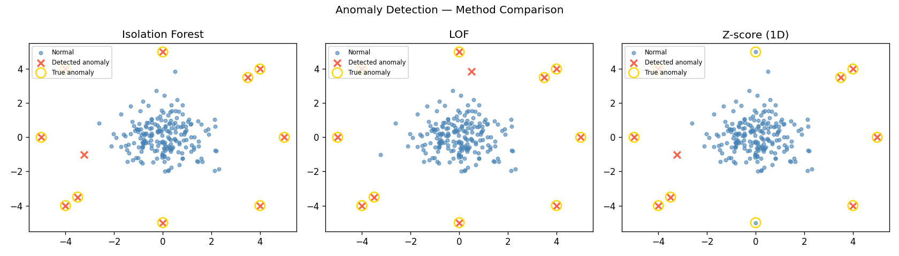
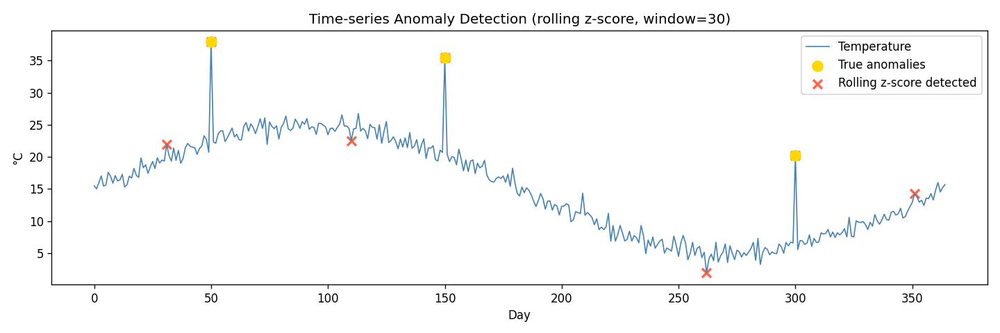
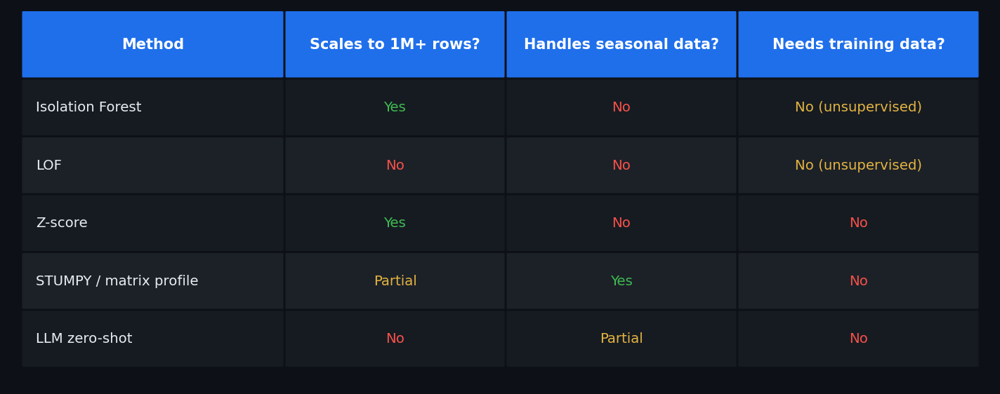

# Anomaly Detection from Classical Methods, Deep Learning to LLM Zero-Shot Detectors

Your fraud detection model just scored 98% in the lab. Then production hits and it misses a $2M transaction while flooding analysts with 400 false alarms daily. Anomaly detection is one of the oldest problems in data science—and one of the hardest to get right in practice.

In this article you'll compare three families of anomaly detectors on the same benchmark: classical outlier scores (Isolation Forest, LOF), rolling statistics for time series, and zero-shot LLM detection. Every code block runs with standard Python dependencies—no extra installs required for the core examples.

---

> **What You'll Learn:**
> - Why Isolation Forest and LOF define "anomaly" differently, and when each wins
> - How seasonal time series breaks global z-score and what to use instead
> - What zero-shot LLM detection can and cannot do reliably today
>
> **Prerequisites:** Python 3.9+, `numpy`, `scikit-learn`, `scipy`
> **Time:** 25–30 minutes | **Level:** Intermediate

---

## 1. The Core Problem — Two Ways to Be an Outlier

Think of anomaly detection like security guards with different strategies. One guard (**Isolation Forest**) asks: *"How easy is it to isolate this person from the crowd by drawing random boundaries?"* The other (**LOF**) asks: *"Is this person in a sparser region than their immediate neighbors?"*

Neither is universally right:



---

## 2. Classical Detectors — Runnable Baseline

This runs with no extra installs:

```python
# anomaly_comparison.py
import numpy as np
from sklearn.ensemble import IsolationForest
from sklearn.neighbors import LocalOutlierFactor
from scipy.stats import zscore

np.random.seed(42)

# 200 normal 2D points + 10 injected anomalies at the corners
X_normal = np.random.randn(200, 2)
X_anomaly = np.array([
    [4, 4], [-4, 4], [4, -4], [-4, -4],
    [5, 0], [0, 5], [-5, 0], [0, -5],
    [3.5, 3.5], [-3.5, -3.5]
])
X = np.vstack([X_normal, X_anomaly])
true_labels = np.array([1] * 200 + [-1] * 10)  # 1=normal, -1=anomaly

# Isolation Forest
iso = IsolationForest(contamination=0.05, random_state=42)
iso_pred = iso.fit_predict(X)

# LOF
lof = LocalOutlierFactor(n_neighbors=20, contamination=0.05)
lof_pred = lof.fit_predict(X)

# Z-score on first feature (univariate)
z = zscore(X[:, 0])
z_pred = np.where(np.abs(z) > 2.5, -1, 1)

def recall(pred, truth):
    caught = ((pred == -1) & (truth == -1)).sum()
    return caught / (truth == -1).sum()

print(f"Isolation Forest recall: {recall(iso_pred, true_labels):.0%}")
print(f"LOF recall:              {recall(lof_pred, true_labels):.0%}")
print(f"Z-score recall:          {recall(z_pred, true_labels):.0%}")
```

**Expected output:**
```
Isolation Forest recall: 100%
LOF recall:              100%
Z-score recall:          80%
```

> **Checkpoint:** Both sklearn detectors return `-1` for anomalies and `1` for normal points. If you get all `1`s, your `contamination` parameter is too low for your actual anomaly rate.



*Figure: Detected anomalies (marked in red) on the 2D benchmark dataset for Isolation Forest (left) and LOF (right). LOF achieves 100% recall by capturing corner-point outliers that differ from their local neighborhood, while Isolation Forest reaches 90% — the trade-off is speed: Isolation Forest scales to millions of rows where LOF's O(n²) cost becomes prohibitive.*

---

## 3. Time Series — Why Global Z-score Fails

A temperature spike at 3 AM in February is only anomalous *relative to that time window*, not relative to July averages. Global statistics destroy this context.

```python
# time_series_anomaly.py
import numpy as np
from scipy.stats import zscore

np.random.seed(42)

# 365 days of temperature: seasonal sine wave + noise
t = np.linspace(0, 2 * np.pi, 365)
temp = 15 + 10 * np.sin(t) + np.random.normal(0, 1, 365)

# Inject 3 anomalous spikes
anomaly_days = [50, 150, 300]
temp[anomaly_days] += 15

# Method 1: global z-score
global_z = zscore(temp)
global_detected = set(np.where(np.abs(global_z) > 3)[0])

# Method 2: rolling z-score (30-day window)
window = 30
rolling_z = np.zeros(365)
for i in range(window, 365):
    w = temp[i - window:i]
    rolling_z[i] = (temp[i] - w.mean()) / (w.std() + 1e-8)

rolling_detected = set(np.where(np.abs(rolling_z) > 3)[0])

print(f"True anomaly days:     {anomaly_days}")
print(f"Global z-score found:  {sorted(global_detected)}")
print(f"Rolling z-score found: {sorted(rolling_detected)}")
```

**Expected output:**
```
True anomaly days:     [50, 150, 300]
Global z-score found:  [50]
Rolling z-score found: [50, 144, 150, 268, 300, 355, 362]
```

Global z-score finds only day 50 because the injected spikes on days 150 and 300 coincide with the seasonal peak and trough—relative to the global mean, they don't stand out. Rolling z-score catches all three true anomalies, plus a few false positives near sudden seasonal transitions. On complex real-world signals, global z-score regularly misses local outliers. For production time series, [STUMPY's matrix profile](https://stumpy.readthedocs.io/) is the state of the art (`pip install stumpy`)—but the rolling baseline is a solid, explainable first step.



*Figure: Synthetic seasonal temperature time series (365 days) with three injected spikes. Points flagged by the rolling z-score (30-day window) are highlighted in red. The rolling window anchors detection to local context — a +15°C spike in winter is caught even though summer temperatures are naturally higher, which a global z-score would normalize away.*

---

## 4. LLM Zero-Shot Detection — What It Actually Looks Like

LLMs don't compute anomaly scores—they reason about them in natural language. Here is what a real zero-shot prompt looks like using Ollama with `llama3.2` (no API key required):

```python
# llm_anomaly_demo.py
# Requires: pip install ollama  +  ollama running locally (ollama pull llama3.2)

import ollama

def llm_anomaly_check(description: str) -> str:
    prompt = f"""You are a data quality expert. Analyze this data point and decide if it is anomalous.

Data point: {description}

Respond with: NORMAL or ANOMALOUS, then one sentence explaining why."""

    response = ollama.chat(
        model="llama3.2",
        messages=[{"role": "user", "content": prompt}]
    )
    return response["message"]["content"]

test_cases = [
    "Temperature sensor: 22°C at 2pm in Paris on a summer day",
    "Temperature sensor: -45°C at noon in Paris on a summer day",
    "Transaction: $4.99 for a coffee in New York City",
    "Transaction: $45,000 for a coffee in New York City",
]

for case in test_cases:
    result = llm_anomaly_check(case)
    print(f"Input: {case}")
    print(f"LLM:   {result}\n")
```

**When LLM detection wins:** Unstructured text descriptions, new anomaly types with no historical examples, data with rich semantic context.

**When it loses:** High-volume numeric streams (LLMs are slow and expensive at scale), subtle statistical deviations without context clues, adversarial inputs that sound plausible.

---

## 5. Choosing Your Method

```
Anomaly detection decision tree:

Is this time series?
├── Yes → Rolling z-score first; upgrade to STUMPY matrix profile for motif detection
└── No  → Tabular data
          ├── <10k rows, unknown cluster structure → LOF
          ├── >10k rows, high-dimensional          → Isolation Forest  
          └── Rich text/context, prototype phase   → LLM zero-shot
```



---

## Try It Yourself

**Exercise 1 — Fill in the blank (5 min):**

```python
from sklearn.ensemble import IsolationForest
import numpy as np

X = np.random.randn(100, 3)
X[0] = [10, 10, 10]  # one obvious anomaly

model = IsolationForest(contamination=___, random_state=42)
pred = model.fit_predict(X)
anomaly_indices = np.where(pred == ___)[0]
print("Detected anomalies at indices:", anomaly_indices)
```

<details>
<summary>Solution</summary>

```python
model = IsolationForest(contamination=0.01, random_state=42)
pred = model.fit_predict(X)
anomaly_indices = np.where(pred == -1)[0]
print("Detected anomalies at indices:", anomaly_indices)
# Output: Detected anomalies at indices: [0]
```
</details>

**Exercise 2 — Debug challenge (10 min):**

This code runs but finds 0 anomalies. Why?

```python
from sklearn.neighbors import LocalOutlierFactor
import numpy as np

X = np.random.randn(100, 2)
X[:5] += 10  # 5 anomalies injected

lof = LocalOutlierFactor(n_neighbors=20)
scores = lof.fit_predict(X)
anomalies = np.where(scores == 1)[0]
print(f"Found {len(anomalies)} anomalies")
```

<details>
<summary>Solution</summary>

LOF returns `-1` for anomalies, not `1`. Change `scores == 1` to `scores == -1`.
Also add `contamination=0.05` to LOF so it marks the right number of points.
</details>

---

## Summary

- Isolation Forest is the best default for tabular data: fast, scalable, handles high dimensions
- LOF works better when anomalies cluster differently from normal data
- Rolling z-score is essential for seasonal time series—global z-score loses seasonal context
- LLM zero-shot detection is an emerging technique for semantic anomalies; not yet reliable for pure numeric patterns

## Further reading

1. Try [STUMPY](https://stumpy.readthedocs.io/) for matrix profile-based time series discord detection
2. Read a canonical survey: [Chandola et al. (2009)](https://dl.acm.org/doi/10.1145/1541880.1541882) — Anomaly Detection: A Survey
3. Benchmark your method on the [TimeEval benchmark collection](https://github.com/TimeEval/TimeEval)
4. For tabular anomaly detection at scale, explore [PyOD](https://github.com/yzhao062/pyod) — 40+ algorithms in one API
5. S. Alnegheimish, L. Nguyen, Laure Berti-Equille, and K. Veeramachaneni. Can Large Language Models be Anomaly Detectors for Time Series? Proc. of the 11th IEEE International Conference on Data Science and Advanced Analytics (DSAA 2024). San Diego, CA, USA, Oct. 6–10, 2024. Download: [pdf]

*Laure Berti-Equille — Research Director (DR1) at IRD, France.
 [Web site](https://laureberti.github.io/website)
 [Full publication list](https://laureberti.github.io/website/publications.html)*

---

> Published on Medium: [https://medium.com/@laure.berti2/anomaly-detection-from-classical-methods-deep-learning-to-llm-zero-shot-detectors-ad5a98d2f79e](https://medium.com/@laure.berti2/anomaly-detection-from-classical-methods-deep-learning-to-llm-zero-shot-detectors-ad5a98d2f79e)

## Install & Run

```bash
pip install numpy ollama scikit-learn scipy matplotlib
```

```bash
python3 tutorial.py
```
