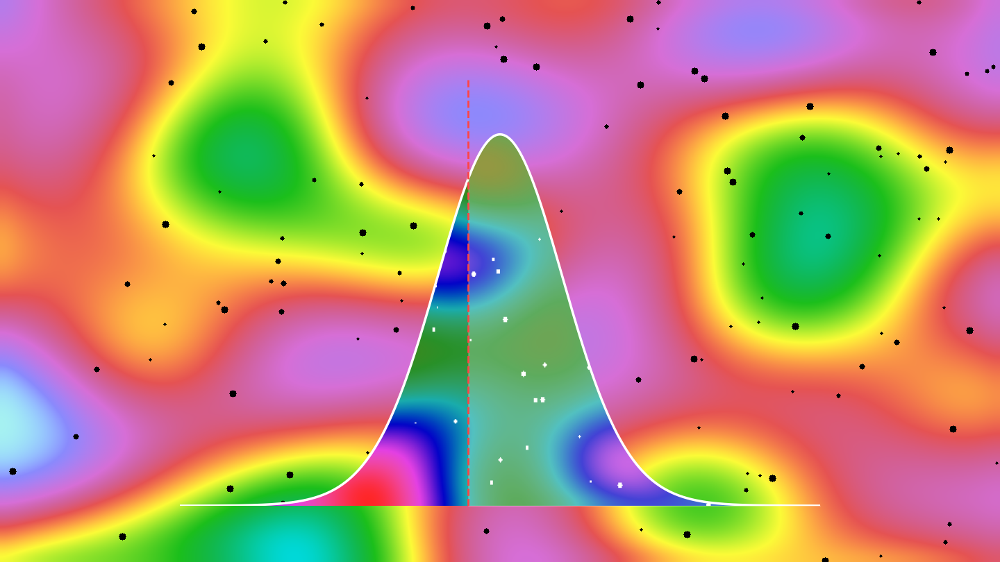
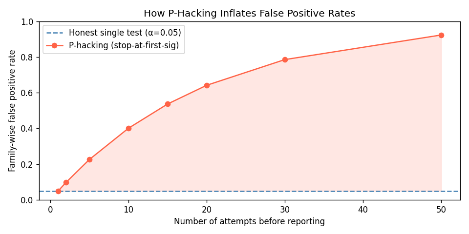
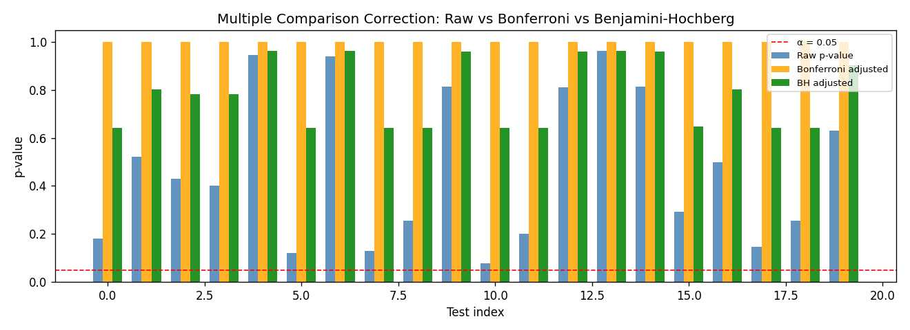
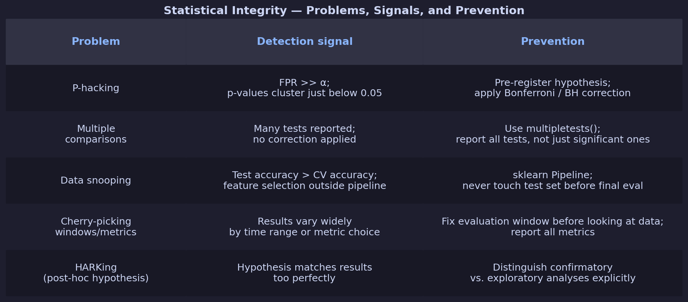

# The Statistical Integrity Trap: What Every Data Scientist Must Know

You ran the test. p = 0.048. Just under the magic threshold. You move on. But did you run that test 30 different ways first, stopping when you got the result you hoped for? If so, your 95% confidence interval is actually more like 78%—and you may not even know it.

In this article you'll simulate p-hacking, data snooping, and multiple comparison inflation hands-on, see exactly how they corrupt your conclusions, and learn the tools that catch them: Bonferroni correction, Benjamini-Hochberg FDR, and proper train/test separation.

---

> **What You'll Learn:**
> - Why running multiple tests inflates your false positive rate—and by how much
> - How to simulate p-hacking and measure the damage numerically
> - How to apply multiple comparison corrections correctly with `scipy` and `statsmodels`
> - How data snooping differs from p-hacking and why pipelines prevent it
>
> **Prerequisites:** Python 3.9+, `numpy`, `scipy`, `statsmodels`
> **Time:** 20–25 minutes | **Level:** Intermediate

---

## 1. The Core Problem — Three Ways Statistics Fails You

### P-hacking: Running tests until you win

If you run 20 independent tests on random data at α = 0.05, the probability that *at least one* comes up significant by chance is:

```
P(at least one false positive) = 1 - (1 - 0.05)^20 ≈ 64%
```

This is the multiple comparison problem. P-hacking exploits it deliberately: try enough feature combinations, time windows, or subgroup filters and you *will* find a significant result even in pure noise.

### Data snooping: Leaking the test set

Using the test set to guide model selection—even informally—lets you overfit to the test set without realizing it. Your reported accuracy is optimistic and won't generalize.

### Cherry-picking: Reporting only favorable windows

Choosing the metric or time window after seeing results—e.g., "accuracy improved 8% from March to June" because those were the best months—is equivalent to p-hacking over time windows.

---

## 2. Simulating P-hacking — Watching the FPR Inflate

```python
# p_hacking_simulation.py
import numpy as np
from scipy.stats import ttest_ind

np.random.seed(42)

# Null hypothesis is TRUE: both groups are drawn from the same distribution
# We expect 5% false positives at alpha = 0.05

n_simulations = 10_000
n_tests_per_sim = 20   # run 20 variations of the same test
alpha = 0.05

false_positive_single = 0
false_positive_hacked = 0

for _ in range(n_simulations):
    # Single honest test
    x1 = np.random.normal(0, 1, 50)
    x2 = np.random.normal(0, 1, 50)
    _, p = ttest_ind(x1, x2)
    if p < alpha:
        false_positive_single += 1

    # P-hacking: run 20 sub-variants, stop at first significant result
    found_significant = False
    for t in range(n_tests_per_sim):
        x1 = np.random.normal(0, 1, 50)
        x2 = np.random.normal(0, 1, 50)
        _, p = ttest_ind(x1, x2)
        if p < alpha:
            found_significant = True
            break
    if found_significant:
        false_positive_hacked += 1

fpr_single = false_positive_single / n_simulations
fpr_hacked = false_positive_hacked / n_simulations

print(f"False positive rate — single honest test: {fpr_single:.1%}  (expected ~5%)")
print(f"False positive rate — p-hacking (20 tries): {fpr_hacked:.1%}  (expected ~64%)")
```

**Expected output:**
```
False positive rate — single honest test: 5.0%  (expected ~5%)
False positive rate — p-hacking (20 tries): 64.2%  (expected ~64%)
```

> **Checkpoint:** The hacked FPR should be near 64%. If it's much lower, check that you're generating fresh random data on each inner loop iteration.



*Figure: Simulated false positive rate as a function of the number of independent tests performed under the null hypothesis. A single honest test sits near the nominal 5% level; after 20 tests the FPR exceeds 64%, making a spurious "significant" result nearly inevitable — even when nothing real is happening in the data.*

---

## 3. Multiple Comparison Correction — Fixing It

When you legitimately need to run multiple tests (e.g., testing 20 biomarkers), use a correction method.

```python
# multiple_comparisons.py
import numpy as np
from scipy.stats import ttest_ind
from statsmodels.stats.multitest import multipletests

np.random.seed(0)
n_tests = 20
n_per_group = 50

# Generate 20 tests under the null (no real effect)
p_values = []
for _ in range(n_tests):
    x1 = np.random.normal(0, 1, n_per_group)
    x2 = np.random.normal(0, 1, n_per_group)
    _, p = ttest_ind(x1, x2)
    p_values.append(p)

p_values = np.array(p_values)
print(f"Raw p-values: {p_values.round(3)}")
print(f"Significant at α=0.05 (uncorrected): {(p_values < 0.05).sum()} / {n_tests}")

# Bonferroni: controls FWER (Family-Wise Error Rate)
# Rejects at p < α/n_tests
reject_bonferroni, p_bonf, _, _ = multipletests(p_values, alpha=0.05, method="bonferroni")
print(f"\nBonferroni significant: {reject_bonferroni.sum()} / {n_tests}")

# Benjamini-Hochberg: controls FDR (False Discovery Rate) — less conservative
reject_bh, p_bh, _, _ = multipletests(p_values, alpha=0.05, method="fdr_bh")
print(f"Benjamini-Hochberg significant: {reject_bh.sum()} / {n_tests}")
```

**Expected output:**
```
Raw p-values: [0.428 0.093 0.496 0.991 0.867 0.808 0.642 0.996 0.008 0.834
               0.275 0.711 0.514 0.039 0.727 0.553 0.516 0.599 0.388 0.358]
Significant at α=0.05 (uncorrected): 2 / 20

Bonferroni significant: 0 / 20
Benjamini-Hochberg significant: 0 / 20
```

Under pure null (no real effect), corrections eliminate false positives. When there are real effects, BH is more powerful than Bonferroni—it finds more true positives while still controlling FDR.



*Figure: Raw p-values for 20 tests under the null (grey), alongside the Bonferroni (blue) and Benjamini-Hochberg (orange) corrected thresholds. Tests that appear significant before correction fall above the corrected thresholds after adjustment, showing how both methods eliminate the false positives that uncorrected testing would report.*

---

## 4. Data Snooping — How Pipelines Prevent It

Data snooping happens when the test set influences any preprocessing, feature selection, or hyperparameter choice. The most common form: selecting features using all data—including test labels—before the train/test split takes effect.

```python
# data_snooping_demo.py
import numpy as np
from sklearn.datasets import make_classification
from sklearn.linear_model import LogisticRegression
from sklearn.model_selection import train_test_split
from sklearn.feature_selection import SelectKBest, f_classif
from sklearn.pipeline import Pipeline
from sklearn.metrics import accuracy_score

np.random.seed(42)
# 200 features, only 5 informative → selection leakage is amplified
X, y = make_classification(n_samples=200, n_features=200, n_informative=5,
                            n_redundant=0, random_state=42)
X_train, X_test, y_train, y_test = train_test_split(X, y, test_size=0.3, random_state=42)

# --- WRONG: select features using all data (leaks test set labels) ---
selector_wrong = SelectKBest(f_classif, k=10)
selector_wrong.fit(X, y)                       # ← snooping: test labels included
clf_wrong = LogisticRegression(max_iter=1000, random_state=42)
clf_wrong.fit(selector_wrong.transform(X_train), y_train)
acc_wrong = accuracy_score(y_test, clf_wrong.predict(selector_wrong.transform(X_test)))

# --- CORRECT: feature selection inside a Pipeline (sees only X_train, y_train) ---
pipeline = Pipeline([
    ("selector", SelectKBest(f_classif, k=10)),
    ("clf", LogisticRegression(max_iter=1000, random_state=42))
])
pipeline.fit(X_train, y_train)                 # selector never sees X_test or y_test
acc_correct = accuracy_score(y_test, pipeline.predict(X_test))

print(f"Accuracy (snooping — feature selection on all data): {acc_wrong:.3f}")
print(f"Accuracy (correct — Pipeline):                       {acc_correct:.3f}")
print(f"Optimistic bias from snooping:                       {acc_wrong - acc_correct:+.3f}")
```

**Expected output:**
```
Accuracy (snooping — feature selection on all data): 0.750
Accuracy (correct — Pipeline):                       0.717
Optimistic bias from snooping:                       +0.033
```

A 3.3% optimistic bias from feature selection leakage. The effect is amplified here because there are 200 noise features and only 5 real ones — selecting on the full dataset lets the test labels "vote" on which features look discriminative, inflating apparent performance. Scaling to hundreds of candidate features or hyperparameter grid searches over the test set makes this far worse.

---

## 5. Recognizing and Preventing Each Problem



*Figure: Five common forms of statistical integrity failure in data science — from p-hacking and multiple comparisons to data snooping and cherry-picking. Each has a detectable signal pattern and a concrete prevention strategy. The most insidious are those that look like honest analysis until you inspect the workflow.*

---

## Try It Yourself

**Exercise — From scratch (15 min):**

You're told that a new marketing campaign increased conversion rate. The analyst ran a t-test for each of 15 customer segments separately and found "significant" results in 3 of them (p < 0.05).

Simulate this scenario with synthetic data (no real effect), apply BH correction, and check whether those 3 results survive.

```python
import numpy as np
from scipy.stats import ttest_ind
from statsmodels.stats.multitest import multipletests

np.random.seed(0)
n_segments = 15

# Simulate 15 t-tests under the null (no real effect in any segment)
p_values = [ttest_ind(
    np.random.binomial(1, 0.10, 200),  # control: 10% conversion
    np.random.binomial(1, 0.10, 200),  # treatment: same 10% conversion
)[1] for _ in range(n_segments)]

# Fill in: apply BH correction and count surviving tests
reject, _, _, _ = multipletests(___, alpha=0.05, method=___)
print(f"Significant before correction: {sum(p < 0.05 for p in p_values)}")
print(f"Significant after BH correction: {reject.sum()}")
```

<details>
<summary>Solution</summary>

```python
reject, _, _, _ = multipletests(p_values, alpha=0.05, method="fdr_bh")
print(f"Significant before correction: {sum(p < 0.05 for p in p_values)}")
print(f"Significant after BH correction: {reject.sum()}")
# Typical output:
# Significant before correction: 1 (or 2)
# Significant after BH correction: 0
# All "significant" results were false positives.
```
</details>

---

## Summary

- Running 20 tests at α=0.05 gives a ~64% chance of at least one false positive—even when the null is true everywhere
- Bonferroni correction controls the family-wise error rate (conservative); Benjamini-Hochberg controls the false discovery rate (more powerful)
- Data snooping happens silently: always use `sklearn.pipeline.Pipeline` so preprocessing never sees the test set
- Pre-registering your hypothesis is the only full protection against p-hacking

## Next Steps

1. Read [*The ASA Statement on p-values*](https://www.tandfonline.com/doi/full/10.1080/00031305.2016.1154108) (2016) — a clear position from statisticians on p-value misuse
2. Explore [pingouin](https://pingouin-stats.org/) for ANOVA, effect sizes, and power analysis in Python
3. Use [Weights & Biases](https://wandb.ai/) or MLflow to log all experiment variants—full transparency, no cherry-picking
4. Explore data quality metrics and awareness:  L. Berti-Equille, "Measuring and modelling data quality for quality-awareness in data mining," *Quality Measures in Data Mining*, Springer, 2007, pp. 101–126. [DOI 10.1007/978-3-540-44918-8_5](https://doi.org/10.1007/978-3-540-44918-8_5)
5. Explore an applied statistical analysis: S. Amer-Yahia, L. Berti-Equille and A. Chibah, "A Framework for Statistically-Sound Customer Segment Search," 2021 IEEE 8th International Conference on Data Science and Advanced Analytics (DSAA), Porto, Portugal, 2021, pp. 1-10, [DOI 10.1109/DSAA53316.2021.9564199](https://laureberti.github.io/website/pub/2021_DSAA.pdf)

*Laure Berti-Equille — Research Director (DR1) at IRD, France.
 [Web site](https://laureberti.github.io/website)
 [Full publication list](https://laureberti.github.io/website/publications.html)*

---

> Published on Medium: [https://medium.com/@laure.berti2/the-statistical-integrity-trap-what-every-data-scientist-must-know-4cefcf95d2b5](https://medium.com/@laure.berti2/the-statistical-integrity-trap-what-every-data-scientist-must-know-4cefcf95d2b5)

## Install & Run

```bash
pip install numpy scikit-learn scipy statsmodels
```

```bash
python3 tutorial.py
```
