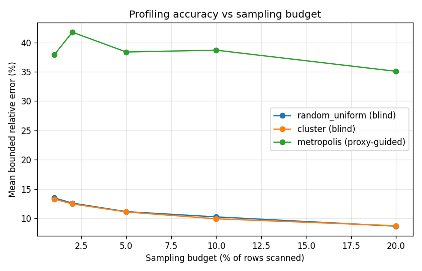
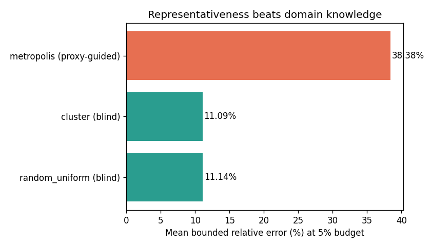

# Data Quality Profiling at Scale: Why Random Sampling Beats Clever Sampling

You have a table with 7 million rows and no documentation. Before any model, any dashboard, any decision, one question comes first: *how dirty is this data?* What fraction of cells are missing, how many rows are duplicated, how many values are outliers, how often does the data contradict itself?

Computing that profile exactly means scanning every row. At a few hundred thousand rows that is a coffee break. At millions, repeated on a schedule for monitoring, it is a bottleneck. So you sample. And here the intuition kicks in: *surely a smart sampler that seeks out the suspicious rows will estimate the error rates better than a dumb random one.*

It turns out the intuition is wrong. In a benchmark of nine sampling strategies across real administrative datasets, sensor streams, and datasets up to 7.4 million rows, the schema-free samplers — plain random uniform and simple cluster sampling — beat every "clever," domain-guided sampler on every real dataset tested. This post explains why, with runnable code you can execute in seconds.

> **What you'll learn**
> - How a data quality profile is defined (four indicators) and estimated from a sample
> - Why a proxy-guided ("go find the dirty rows") sampler is *biased* for profiling
> - How to measure a sampler's accuracy honestly, with a bounded relative error
>
> **Prerequisites:** Python 3.9+, `numpy`, `pandas`, `matplotlib` · **Time:** ~15 min

---

## The profile: four numbers you actually want

A quality profile reduces a whole table to four rates:

- **missing rate** — fraction of empty cells
- **duplicate rate** — fraction of repeated rows
- **outlier rate** — fraction of numeric cells outside Tukey (1.5×IQR) fences
- **inconsistency rate** — fraction of rows breaking a known rule (e.g. the functional dependency `zip → city`)

The tutorial computes all four in one pass:

```python
def compute_quality_profile(df, weights=None):
    w = np.ones(len(df)) if weights is None else np.asarray(weights, float)
    w = w / w.sum()
    missing_rate   = np.dot(w, df.isna().to_numpy().mean(axis=1))
    duplicate_rate = np.dot(w, df.duplicated().to_numpy().astype(float))
    # outlier_rate via vectorized Tukey fences; inconsistency via zip -> city
    ...
```

The `weights` argument matters more than it looks — we come back to it.

## Two families of samplers

The paper groups nine strategies into two families. The tutorial implements one representative of each side:

**Blind samplers** ignore the content. `random_uniform` draws `k` rows uniformly. `cluster` splits the table into `max(10, √N)` contiguous blocks and draws whole blocks — one disk seek per block, ideal for large files.

**Proxy-guided samplers** use a cheap "dirtiness" score per row and preferentially sample high-score rows, hoping to spend the budget where the errors are. The tutorial's `metropolis` sampler scores each row by its outlier-and-missing fraction and samples proportionally:

```python
def sample_metropolis(df, k, rng):
    proxy = _error_proxy(df)              # outlier frac + missing frac per row
    prob  = proxy / proxy.sum()
    idx   = rng.choice(len(df), size=k, replace=False, p=prob)
    weights = 1.0 / prob[idx]             # Horvitz-Thompson (inverse-probability)
    return df.iloc[idx], weights
```

Notice the `weights`. If you over-sample dirty rows, your naive estimate of the missing rate is *inflated* — you looked mostly at the bad rows. To be unbiased you must down-weight them by the inverse of their sampling probability (Horvitz-Thompson estimation). The proxy-guided sampler can only be correct *with* this correction — and even then, concentrating the budget on a skewed subset inflates the variance of the estimate.

## Measuring accuracy honestly

Compare each sampled profile to the full-scan ground truth with a **bounded relative error**: for each indicator, `|estimate − truth| / max(truth, 0.05)`, capped at 100%, then averaged. The `max(·, 0.05)` floor stops the metric exploding when a true rate is near zero, and the cap keeps a single blown indicator from dominating.

## The result

Run `tutorial.py` on a 200,000-row synthetic table with injected missingness, duplicates, outliers, and `zip → city` violations. At a 5% sampling budget, averaged over five seeds:



The two blind samplers converge to the true profile within a few percent of the data; the proxy-guided sampler stays roughly three to four times worse at every budget.



These are illustrative numbers on synthetic data — but they reproduce the paper's finding on **real** datasets, where the gap is far more dramatic. On NYC 311 (500K rows), at a 5% budget:

- **random uniform: 0.49% mean relative error**
- **DAG-guided MCMC: 19.5%** — about **40× worse**

And it is not a speed–accuracy trade you are buying with the clever method: on the ultra-large datasets the DAG sampler ran **28–47× slower** while being **6× less accurate**. Scaling behaviour tells the same story — random uniform grows near-linearly (O(N^0.964)) while DAG is super-linear (O(N^1.272)). **Cluster sampling matched random uniform with no added complexity.**

## Why representativeness wins

A quality profile is a set of *population averages*. The unbiased, minimum-variance way to estimate a population average is a representative sample — exactly what random and cluster sampling give you for free. A proxy-guided sampler deliberately makes its sample *un*-representative, then has to undo the damage with importance weights that add variance. It is optimising for the wrong target: *finding* errors, not *measuring* their rate. The two goals pull in opposite directions.

## Limitations and honest caveats

- The tutorial uses synthetic data so the ground truth is known; its absolute error numbers are illustrative, not the paper's.
- Proxy-guided sampling is not useless — if your goal is *retrieval* (surface the dirtiest records for a human to fix), a targeted sampler is exactly right. The finding is specifically about *profiling* — estimating rates.
- Cluster sampling assumes errors are not perfectly aligned with block boundaries; pathological layouts (e.g. all duplicates in one contiguous block) can hurt it, which is why the benchmark reports it alongside random uniform rather than instead of it.

## Takeaway

Before reaching for a sophisticated sampler, try random uniform. For profiling at scale it is fast, unbiased, near-linear, and — as a nine-strategy benchmark up to 7.4M rows shows — hard to beat.

---

## Further Reading

1. L. Berti-Équille, *Data Quality Profiling at Scale with Progressive Sampling: A Benchmark for Data-Centric AI Pipelines*, Transactions on Large-Scale Data- and Knowledge-Centered Systems (TLDKS), Springer. — the paper this tutorial is based on; full nine-strategy benchmark, real datasets, and scaling analysis.
2. L. Berti-Équille, *Learn2Clean: Optimizing the Sequence of Tasks for Web Data Preparation*, The Web Conference (WWW) 2019. — a data-centric view of how cleaning and preparation choices propagate into downstream model quality.
3. Try it yourself: swap in one of your own CSVs, add a sampler (geometric, stratified, importance-weighted), and see whether *any* clever strategy beats random uniform on your data.

## Install & Run

```bash
pip install numpy pandas matplotlib
```
```bash
python3 tutorial.py
```

The script prints the full-scan profile and the per-sampler error at a 5% budget, and writes two figures to `figures/`.
