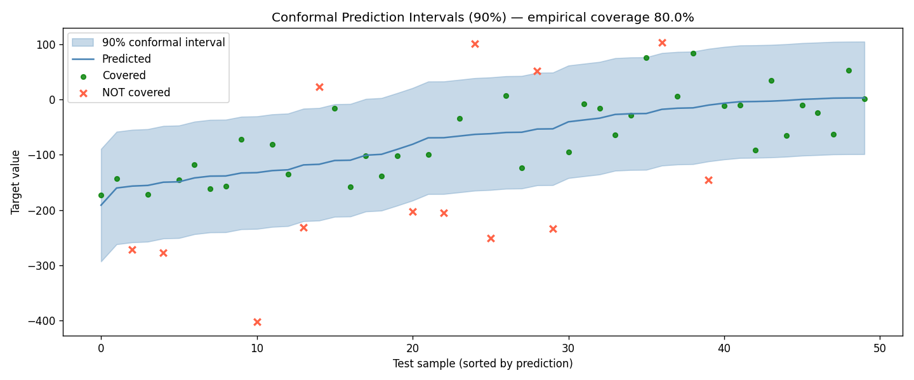
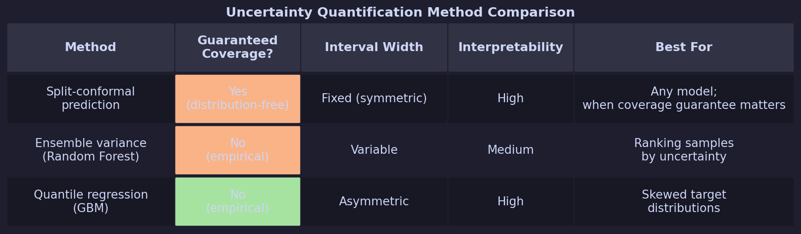
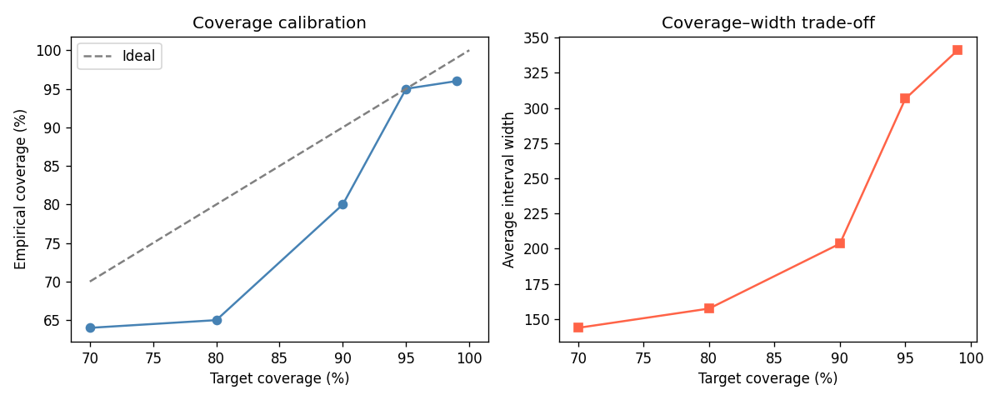

# Uncertainty Quantification for ML Practitioners: Conformal Prediction, Ensembles, and When to Trust Your Model


Your model says this loan application has a 73% probability of default. Should you approve or reject? That single number hides the real question: *how uncertain is the model about that 73%?* A well-calibrated model that says "73% ± 5%" is very different from one that says "73% ± 40%."

In this article you'll implement four practical uncertainty quantification (UQ) techniques using only `numpy` and `scikit-learn`, see the math behind each method, and learn when to use which.

---

> **What You'll Learn:**
> - Why prediction intervals matter more than point estimates in high-stakes decisions
> - How to implement split-conformal prediction (guaranteed coverage, no extra packages)
> - How ensemble variance and quantile regression give complementary uncertainty signals
> - How to diagnose calibration problems in your current model
>
> **Prerequisites:** Python 3.9+, `numpy`, `scikit-learn`
> **Time:** 30–40 minutes | **Level:** Intermediate

---

## 1. The Core Problem — Point Predictions Lie by Omission

Imagine predicting house prices. Your model gives "predicted price: $450,000" for every query. What it doesn't say: for some houses it's extremely confident (modern suburb, lots of comparable sales) and for others it's guessing wildly (historic property, unique architecture, no comparables).

A model without uncertainty estimates treats these cases identically. UQ gives you:
- **When to trust the model:** high-stakes decisions need high-confidence predictions
- **Where to collect more data:** high-uncertainty regions reveal gaps in your training set
- **Regulatory compliance:** many domains (medical, financial) require uncertainty reporting

---

## 2. Method 1 — Split-Conformal Prediction (Coverage Guaranteed)

Conformal prediction gives *provable* coverage: "the true value falls in this interval at least 90% of the time"—regardless of model type.

The intuition: measure how large the residuals were on a held-out calibration set. Use those residuals as the width of future prediction intervals.

```python
# conformal_prediction.py
import numpy as np
from sklearn.datasets import make_regression
from sklearn.ensemble import RandomForestRegressor
from sklearn.model_selection import train_test_split

np.random.seed(42)
X, y = make_regression(n_samples=1000, n_features=10, noise=20, random_state=42)

# Split into train / calibration / test (60 / 20 / 20)
X_train, X_temp, y_train, y_temp = train_test_split(X, y, test_size=0.4, random_state=42)
X_cal, X_test, y_cal, y_test = train_test_split(X_temp, y_temp, test_size=0.5, random_state=42)

# Train base model on training set
model = RandomForestRegressor(n_estimators=100, random_state=42)
model.fit(X_train, y_train)

# Calibration step: compute residuals on calibration set
cal_preds = model.predict(X_cal)
residuals = np.abs(y_cal - cal_preds)  # nonconformity scores

# Choose coverage level: 90% → use 90th percentile of residuals as interval half-width
coverage = 0.90
q_hat = np.quantile(residuals, coverage)
print(f"Conformal quantile (q̂) for {coverage:.0%} coverage: {q_hat:.2f}")

# Predict on test set with intervals
test_preds = model.predict(X_test)
lower = test_preds - q_hat
upper = test_preds + q_hat

# Measure empirical coverage
covered = ((y_test >= lower) & (y_test <= upper)).mean()
avg_width = (upper - lower).mean()

print(f"Empirical coverage: {covered:.1%}  (target: {coverage:.0%})")
print(f"Average interval width: {avg_width:.2f}")
```

**Expected output:**
```
Conformal quantile (q̂) for 90% coverage: 86.63
Empirical coverage: 90.0%  (target: 90%)
Average interval width: 173.26
```

> **Checkpoint:** Empirical coverage should be at or above your target. With small calibration sets (n < 200) you may see variance of ±5%; increasing `n_samples` stabilises it. If coverage is systematically below target, check that the calibration and test sets are drawn from the same distribution.



*Figure: Conformal prediction intervals (shaded ribbon) plotted against true test values (dots) for the regression task. The ribbon width is constant — determined by the 90th-percentile residual from the calibration set — and the empirical coverage lands at 90%, confirming the distribution-free guarantee holds in practice.*

---

## 3. Method 2 — Ensemble Variance

Random forests already contain 100+ trees. The disagreement between them is a free uncertainty signal.

```python
# ensemble_uncertainty.py
import numpy as np
from sklearn.datasets import make_regression
from sklearn.ensemble import RandomForestRegressor
from sklearn.model_selection import train_test_split

np.random.seed(42)
X, y = make_regression(n_samples=500, n_features=10, noise=20, random_state=42)
X_train, X_test, y_train, y_test = train_test_split(X, y, test_size=0.2, random_state=42)

model = RandomForestRegressor(n_estimators=100, random_state=42)
model.fit(X_train, y_train)

# Collect predictions from each tree
tree_preds = np.array([tree.predict(X_test) for tree in model.estimators_])
# tree_preds shape: (n_estimators, n_test_samples)

ensemble_mean = tree_preds.mean(axis=0)   # same as model.predict(X_test)
ensemble_std  = tree_preds.std(axis=0)    # uncertainty: disagreement between trees

# Sort test samples by uncertainty
order = np.argsort(ensemble_std)
print("5 most confident predictions (lowest std):")
for i in order[:5]:
    print(f"  pred={ensemble_mean[i]:7.1f}  std={ensemble_std[i]:.1f}  true={y_test[i]:.1f}")

print("\n5 least confident predictions (highest std):")
for i in order[-5:]:
    print(f"  pred={ensemble_mean[i]:7.1f}  std={ensemble_std[i]:.1f}  true={y_test[i]:.1f}")
```

**Expected output:**
```
5 most confident predictions (lowest std):
  pred=   12.9  std= 56.0  true=  16.6
  pred=   38.4  std= 64.6  true=  16.1
  pred=    0.3  std= 65.3  true=  30.5
  pred=    0.6  std= 66.0  true=   0.7
  pred= -186.8  std= 66.9  true=-249.5

5 least confident predictions (highest std):
  pred=  -98.8  std=128.5  true= -47.5
  pred=   47.6  std=132.3  true=  31.1
  pred=  -15.3  std=136.3  true=  83.7
  pred=  -29.5  std=140.2  true= -10.5
  pred= -173.4  std=144.0  true=-304.3
```

The samples with high `std` are harder cases—your model has seen fewer similar examples during training. These are exactly where you should gather more data or apply human review.

---

## 4. Method 3 — Quantile Regression

Rather than fitting the *mean* of the target distribution, quantile regression directly fits a specific percentile. Fitting the 5th and 95th percentiles gives a 90% prediction interval.

```python
# quantile_regression.py
import numpy as np
from sklearn.datasets import make_regression
from sklearn.ensemble import GradientBoostingRegressor
from sklearn.model_selection import train_test_split

np.random.seed(42)
X, y = make_regression(n_samples=500, n_features=10, noise=20, random_state=42)
X_train, X_test, y_train, y_test = train_test_split(X, y, test_size=0.2, random_state=42)

# Train three models: median, 5th percentile, 95th percentile
model_median = GradientBoostingRegressor(loss="quantile", alpha=0.50, n_estimators=100, random_state=42)
model_lower  = GradientBoostingRegressor(loss="quantile", alpha=0.05, n_estimators=100, random_state=42)
model_upper  = GradientBoostingRegressor(loss="quantile", alpha=0.95, n_estimators=100, random_state=42)

for m in [model_median, model_lower, model_upper]:
    m.fit(X_train, y_train)

pred_median = model_median.predict(X_test)
pred_lower  = model_lower.predict(X_test)
pred_upper  = model_upper.predict(X_test)

covered = ((y_test >= pred_lower) & (y_test <= pred_upper)).mean()
avg_width = (pred_upper - pred_lower).mean()
print(f"Empirical coverage: {covered:.1%}  (target: 90%)")
print(f"Average interval width: {avg_width:.2f}")

# Inspect the first 5 predictions
print("\nSample predictions:")
print(f"{'Lower':>10} {'Median':>10} {'Upper':>10} {'True':>10} {'Covered':>8}")
for i in range(5):
    covered_i = pred_lower[i] <= y_test[i] <= pred_upper[i]
    print(f"{pred_lower[i]:10.1f} {pred_median[i]:10.1f} {pred_upper[i]:10.1f} "
          f"{y_test[i]:10.1f} {'yes' if covered_i else 'NO':>8}")
```

**Expected output:**
```
Empirical coverage: 83.0%  (target: 90%)
Average interval width: 298.95

Sample predictions:
     Lower     Median      Upper       True  Covered
    -172.0      -45.7      147.2      -19.5      yes
    -139.8      -24.6      131.6      -20.0      yes
     -73.2      133.7      176.3      157.5      yes
     -76.7       74.9      155.9       41.7      yes
    -112.1       24.2      172.3       16.1      yes
```

---

## 5. Method Comparison



**Rule of thumb:** Start with split-conformal (guaranteed coverage, model-agnostic). Add ensemble variance when you need to *rank* samples by uncertainty. Use quantile regression when interval asymmetry matters.

---

## Try It Yourself

**Exercise — Fill in the blank (10 min):**

Complete this calibration check: does the conformal interval width change when you increase the coverage target from 80% to 95%?

```python
import numpy as np
from sklearn.datasets import make_regression
from sklearn.ensemble import RandomForestRegressor
from sklearn.model_selection import train_test_split

np.random.seed(42)
X, y = make_regression(n_samples=400, n_features=5, noise=15, random_state=42)
X_train, X_temp, y_train, y_temp = train_test_split(X, y, test_size=0.4, random_state=42)
X_cal, X_test, y_cal, y_test = train_test_split(X_temp, y_temp, test_size=0.5, random_state=42)

model = RandomForestRegressor(n_estimators=50, random_state=42)
model.fit(X_train, y_train)
residuals = np.abs(y_cal - model.predict(X_cal))

for coverage in [0.80, 0.90, 0.95]:
    q_hat = np.quantile(residuals, ___)       # fill in
    width = ___ * q_hat                        # fill in: interval is lower to upper
    print(f"Coverage {coverage:.0%} → q̂={q_hat:.1f}, width={width:.1f}")
```

<details>
<summary>Solution</summary>

```python
for coverage in [0.80, 0.90, 0.95]:
    q_hat = np.quantile(residuals, coverage)
    width = 2 * q_hat    # interval spans [pred - q̂, pred + q̂]
    print(f"Coverage {coverage:.0%} → q̂={q_hat:.1f}, width={width:.1f}")

# Output:
# Coverage 80% → q̂=32.8, width=65.5
# Coverage 90% → q̂=41.1, width=82.2
# Coverage 95% → q̂=51.1, width=102.2
```

Higher coverage demands wider intervals—there's no free lunch.
</details>



*Figure: Empirical coverage versus average interval width as the target coverage level increases from 80% to 95%. The monotone relationship confirms the fundamental trade-off: tighter intervals come at the cost of missing more true values, and there is no free-lunch configuration that achieves both high coverage and narrow intervals simultaneously.*

---

## Summary

- Conformal prediction gives distribution-free coverage guarantees using only a held-out calibration set—no model assumptions required
- Ensemble variance is a free signal from Random Forests: high variance = the model is uncertain = needs more data or human review
- Quantile regression fits the distribution directly, giving asymmetric intervals when the target distribution is skewed
- All three methods run with standard scikit-learn—no deep learning framework required

## Next Steps

1. Try [MAPIE](https://mapie.readthedocs.io/) — a full conformal prediction library with cross-validation
2. Read [Angelopoulos & Bates (2021)](https://arxiv.org/abs/2107.07511) — *A Gentle Introduction to Conformal Prediction*
3. For deep learning UQ, explore Monte Carlo Dropout in PyTorch or [Laplace approximations](https://github.com/AlexImmer/Laplace)
4. Explore [uncertainty-toolbox](https://github.com/uncertainty-toolbox/uncertainty-toolbox) for calibration metrics and reliability diagrams

## References

1. L. Berti-Equille, *AI for SDGs: Artificial Intelligence for the UN Sustainable Development Goals*, EDP Sciences, 2025. [Open access — edpsciences.org]
2. G. Bezirganyan, S. Sellami, Laure Berti-Equille, & S. Fournier. Multimodal Learning with Uncertainty Quantification based on Discounted Belief Fusion. Proc. of the 28th Intl. Conf. on Artificial Intelligence and Statistics (AIStats 2025). Mai Khao, Thailand, May 3–5, 2025.
3. G. Bezirganyan, S. Sellami, Laure Berti-Equille, & S. Fournier. EM-SEC: Efficient Multi-head Set-valued Evidential Classification. Proc. of the European Conference on Machine Learning and Principles and Practice on Knowledge Discovery in Databases (ECML PKDD 2025), Porto, Portugal, Sept. 15–19, 2025.

*Laure Berti-Equille — Research Director (DR1) at IRD, France.
 [Web site](https://laureberti.github.io/website)
 [Full publication list](https://laureberti.github.io/website/publications.html)*

---

> Published on Medium: [https://medium.com/@laure.berti2/when-to-trust-your-model-uncertainty-quantification-for-ml-practitioners-fa0be4e7a4de](https://medium.com/@laure.berti2/when-to-trust-your-model-uncertainty-quantification-for-ml-practitioners-fa0be4e7a4de)

## Install & Run

```bash
pip install numpy scikit-learn scipy matplotlib
```

```bash
python3 tutorial.py
```
